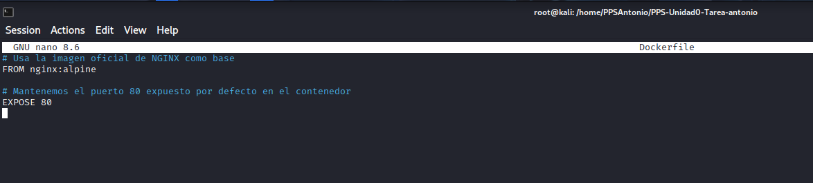
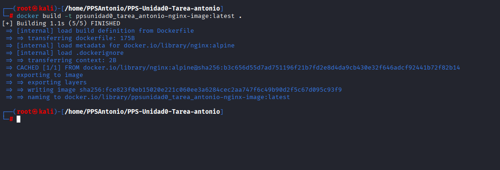
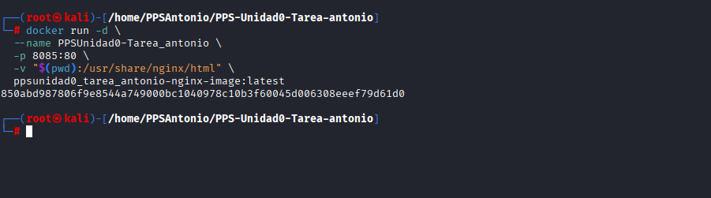
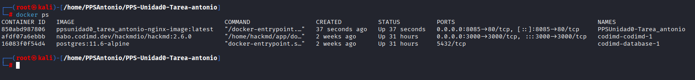

# Creación de un contenedor de servicios NGINX con Docker

Creamos un archivo llamado Dockerfile en la raíz de tu repositorio con el siguiente contenido mínimo.

Construimos la imagen.

Ejecutamos el contenedor utilizando la imagen que acabamos de crear. 
Aquí es donde especificamos el nombre del contenedor, el puerto redirigido y el **bind-mount** de la carpeta del repositorio.

Verificamos que el contenedor está activo.

Creamos un archivo **index.html** para que nginx no muestre el contenido de los md con el siguiente contenido.

Acceder al repositorio a través del navegador web.

Información sobre el contenedor con docker inspect.

